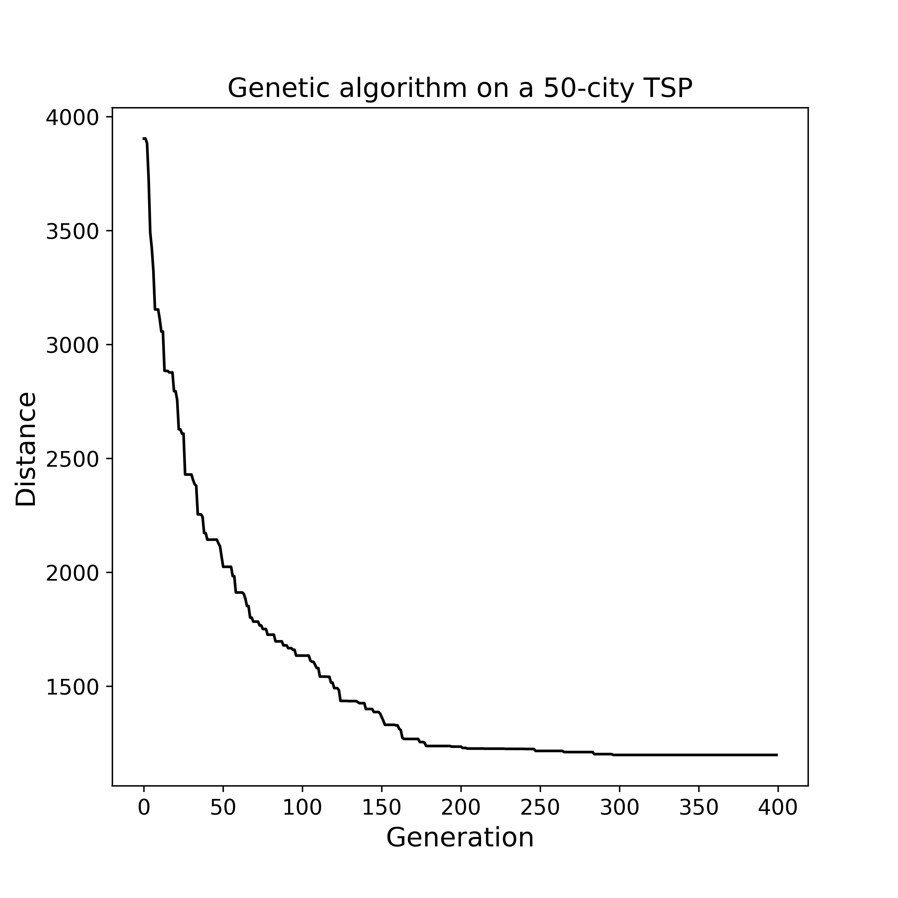

# Genetic Travelling Salesman

### Overview

* A simple genetic algorithm for the [Travelling salesman problem](https://en.wikipedia.org/wiki/Travelling_salesman_problem). 
* < 100 lines of code
* Achieves reasonable performance for 25, 50, 100 cities
* Optimal solution isn't guaranteed as the algorithm can get stuck in local minima / be slow to converge, but empirically was found to work well

### 25 cities

* Convergence is fast

* Snapshot of each generation (with freeze on finish)

### 50 cities

* Convergence is fast

* Snapshot of every 10th generation (with freeze on finish)

### 100 cities

* Convergence is reasonable

* Snapshot of every 10th generation (with freeze on finish)

